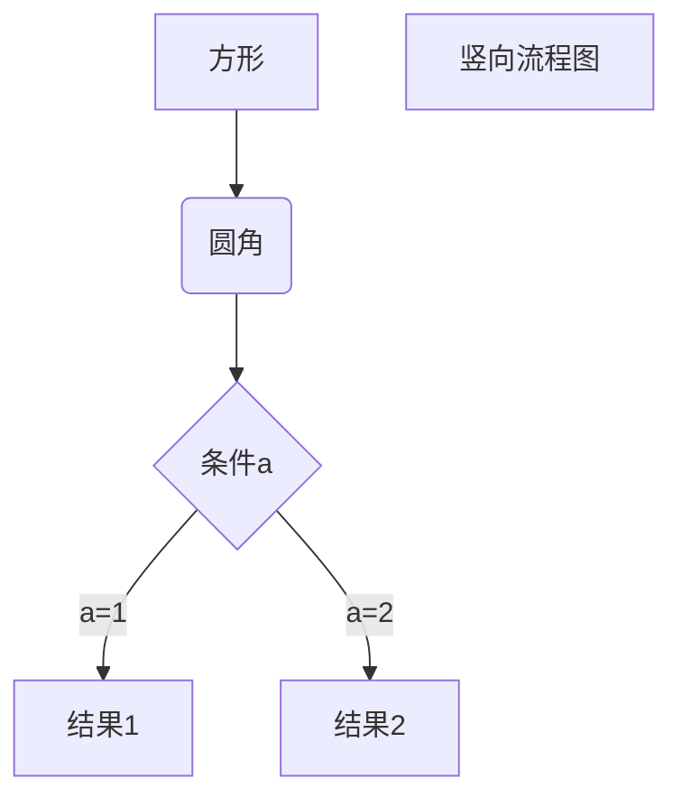

# Markdown
官方文档
创始人的markdown语法说明
https://daringfireball.net/projects/markdown/syntax

## 1.格式
### 1.1	标题
在文本前面加上 # 即可，总共六级标题，标题字号相应降低。
```
# 一级标题
## 二级标题
### 三级标题
#### 四级标题
##### 五级标题
###### 六级标题 
```
### 1.2	列表格式
无序列表
在文字前加上 - 或 * 或 + 即可
- 文本1
- 文本2
- 文本3

有序列表
在文字前加：数字序号.<space>文本
1. 文本1
2. 文本2
3. 文本3

列表嵌套
上一级和下一级之间敲三个空格即可
- 一级无序列表内容
  - 二级无序列表内容
  - 二级无序列表内容
  - 二级无序列表内容

### 1.3	引用
在你希望引用的文字前面加上 >，注意 > 和文本之间要保留一个字符的空格。

> 一盏灯， 一片昏黄； 一简书， 一杯淡茶。

### 1.4	粗体和斜体

用两个 * 包含一段文本就是粗体的语法，用一个 * 包含一段文本就是斜体的语法。要倾斜和加粗的文字左右分别用三个*号包起来。用两个~~号包起来是加删除线的语法。例如：

 *这是斜体*，**这是粗体**，***这是加粗的斜体***，~~这是加删除线的文字~~，这是平常字体。

### 1.5	代码引用
如果引用的语句只有一段，不分行，可以用 ` 将语句包起来。
如果引用的语句为多行，可以将```置于这段代码的首行和末行。


```c++
int a[3][4] = { 0,1,2,3,4,5,6,7,8,9,10,11 };
int(*p)[4];
p = a;
std::cout << (*p)[0] << ' ' << (*p)[1] << ' ' << (*p)[2] << ' ' << (*p)[3] << ' '<< std::endl;
std::cout << *p[0] << ' ' << *p[1] << ' ' << *p[2] << ' ' << std::endl;
```

### 1.6 注释
在正文中不显示：\
\<!-- your comment goes here -->
<!-- 这里不会显示 -->


## 2. 图表
### 2.1	表格
语法：
```
表头|表头|表头
---|:--:|---:
内容|内容|内容
内容|内容|内容
```
第二行分割表头和内容。
- \- 有一个就行，为了对齐，多加了几个
文字默认居左
- 两边加：表示文字居中
- 右边加：表示文字居右
注：原生的语法两边都要用 | 包起来。此处省略


示例代码：
| Tables        | Are           | Cool  |
| ------------- |:-------------:| -----:|
| col 3 is      | right-aligned | $1600 |
| col 2 is      | centered      |   $12 |
| zebra stripes | are neat      |    $1 |


### 2.2	流程图

```flow
st=>start: 开始
op=>operation: My Operation
cond=>condition: Yes or No?
e=>end
st->op->cond
cond(yes)->e
cond(no)->op
```




### 2.3 图片引用
#### 本地图片


## 3. 数学公式
$ 2=2^0 $